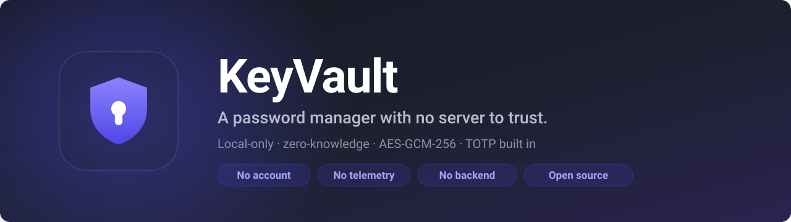

<p align="center">
  
</p>

<p align="center">
  <strong><a href="https://shipiit.github.io/keyvault/">keyvault website</a></strong>
  &nbsp;&middot;&nbsp;
  <a href="https://github.com/shipiit/keyvault/releases/latest">Download v0.3.0</a>
  &nbsp;&middot;&nbsp;
  <a href="INSTALL.md">Install guide</a>
</p>

<p align="center">
  <a href="https://github.com/shipiit/keyvault/actions/workflows/ci.yml"></a>
  
  
  
  <a href="LICENSE"></a>
</p>

# KeyVault

A local-only, zero-knowledge password manager for Chromium browsers. Stores
credentials and TOTP two-factor secrets in an encrypted vault that never leaves
your machine.

> **Status: works, and in daily use. Not yet independently audited.**
>
> Every stage is built: encrypted vault, autofill, save prompts, TOTP, the
> in-field badge, generator, Watchtower, backups and imports. What it has not
> had is a review by anyone but its author — so if you are moving from a
> commercial manager, keep an export of your old vault until you trust this
> one. See [Project status](#project-status) for the detail.

---

## Why another password manager

Most browser password managers ask you to trust a server. KeyVault has no server
to trust: there is no backend, no account, and no telemetry. Your vault is a
single encrypted blob in your own browser's storage.

Two features talk to a network, and nothing else does. **Breach checking** is
off until you turn it on, and sends five characters of a password hash — never a
password. **Update checking** is on, and asks GitHub once a day whether a newer
release exists; it sends no vault data, no identifier, and not even your version
number. Both are switchable in Settings, and neither can read your vault.

That design has a real cost, stated plainly: **if you forget your master
password, your vault is unrecoverable.** There is no reset link, because there is
nobody holding a key to reset it with. Export a backup as soon as you create a
vault.

---

## Features

|                        |                                                                                                                     |
| ---------------------- | ------------------------------------------------------------------------------------------------------------------- |
| **Encrypted vault**    | AES-GCM-256 under a PBKDF2-derived key. Auto-locks on a timer and on browser close.                                 |
| **Autofill**           | Detects login forms and fills them, including React/Vue apps that ignore naive value assignment.                    |
| **Save prompt**        | Offers to save or update a credential after you log in.                                                             |
| **Auto-login**         | Opt-in **per credential**, off by default. See [Security](#security).                                               |
| **TOTP 2FA**           | Scan a QR code, upload a QR image, or paste an `otpauth://` URI. Live 6-digit codes with a countdown.               |
| **Password generator** | Configurable length and character classes, built on a bias-free CSPRNG.                                             |
| **Import / export**    | Encrypted backup files, plus importers for 1Password, Bitwarden, LastPass, and Chrome CSV.                          |
| **Password strength**  | Offline, pattern-aware estimate with an honest time-to-crack figure.                                                |
| **Breach check**       | Optional, off by default. Tells you if a password appears in public breach data, without sending the password.      |
| **In-field badge**     | A KeyVault mark inside the login box; click for your matching logins, in a closed shadow root the page cannot read. |
| **Watchtower**         | Every weak, reused, breached or stale password, grouped by problem, each one a click from the item that causes it.  |
| **Trash with undo**    | Deleting is reversible. Nothing is purged on a timer, because no server holds a second copy.                        |
| **Touch ID unlock**    | WebAuthn PRF wraps the vault key to your device. Prompts on its own; the master password always still works.        |
| **API credentials**    | Keys and tokens with environment, expiry and hostname. The issuer is named from the key's own prefix, offline.      |
| **SSH keys**           | Public and private halves, with the fingerprint `ssh-keygen -lf` prints, derived locally from the public key.       |
| **Custom fields**      | Named sections of typed fields. Hidden ones are masked, excluded from search, and stripped before any projection.   |
| **Tags**               | Cross-cutting grouping, folded case-insensitively so `Work` and `work` stay one tag rather than two.                |
| **Archive**            | Keep an item without it being offered to a login form again. Separate from the trash, and nothing here expires.     |
| **Missing 2FA**        | Logins on sites known to support a second factor where you have no code stored. Checked against a bundled list.     |

---

## Security

### How the vault is protected

| Layer          | Choice                                                                                                        |
| -------------- | ------------------------------------------------------------------------------------------------------------- |
| Encryption     | AES-GCM-256, fresh random 96-bit IV per write                                                                 |
| Key derivation | PBKDF2-SHA256, 600,000 iterations, 16-byte per-vault salt                                                     |
| Unlock check   | Two-stage verifier record — never a stored password or password hash                                          |
| At rest        | `chrome.storage.local` only. Never `chrome.storage.sync`, which round-trips through Google.                   |
| In memory      | The derived key is never written to disk and is cleared when the browser closes                               |
| Network        | Two requests exist: breach checking (off by default) and a daily update check (on). Neither sends vault data. |
| CSP            | `script-src 'self'` — no remote code, no `eval`                                                               |

### Design decisions worth knowing about

**Auto-login is opt-in per credential, and off by default.** This is deliberate.
A look-alike domain, a third-party iframe, or a login form injected into a
compromised page can all harvest whatever gets filled and submitted
automatically. Autofill matches on the registrable domain, never fills
cross-origin iframes without an explicit per-site opt-in, and will not submit a
form unless you have ticked that box for that specific entry. 1Password and
Bitwarden both refuse to auto-submit by default for the same reason.

**Search never reads your secrets.** The search box matches on title, username,
URL, and tags only — never passwords, notes, or TOTP secrets. Including them
would turn search into an oracle: anyone at your unlocked browser could type a
guessed password and watch for a match, and secrets would surface in result
lists.

**Random number generation uses rejection sampling.** Reducing random values with
`%` is biased whenever the range is not a power of two. For a password generator
that is a measurable loss of entropy, so bounded integers discard out-of-range
draws instead. There is a statistical test enforcing this.

**PBKDF2 rather than Argon2id.** Argon2id resists GPU cracking better, but needs
a WebAssembly binary, which conflicts with the extension's content-security
policy and materially increases bundle size. 600,000-iteration PBKDF2-SHA256 is
what Bitwarden's browser extension ships and meets the OWASP minimum. Measured
unlock cost is ~157 ms.

### Breach checking

Optional, **off by default**, and the only part of KeyVault that touches a
network.

When you enable it, KeyVault can tell you whether a password appears in public
breach data. It does this without sending the password anywhere, using the
k-anonymity range protocol — the same mechanism 1Password, Bitwarden, and
Chrome's own leak detection use:

1. Your password is hashed with SHA-1, locally.
2. Only the **first five hex characters** of that hash are sent.
3. The server returns every hash suffix it holds under that prefix — typically
   several hundred.
4. The match happens **on your device**.

The server therefore learns a 20-bit prefix shared by roughly one password in a
million. It cannot tell which password you checked, or even whether there was a
match. Requests carry no cookies, no referrer, and no cache entry, and ask for
padded responses so an observer cannot infer the answer from response size.

What KeyVault will not do:

- Send your password, your full password hash, your username, or the site
- Check anything while the feature is off — there is no request at all, not a
  request whose result is discarded
- Report "safe" when the check failed. A network error is reported as
  _unknown_, never as a clean result

Two honest caveats:

- **An occurrence count is not proof your account was breached.** It means the
  password appears in breach corpora, and so is in every attacker's wordlist.
  That is the real risk, whether or not it leaked from a site you use.
- **A clean result is not proof of safety.** It means the password has not been
  seen leaking, not that it is strong.

The host permission for this is declared as _optional_, so a default install
has no network reach at all — Chrome only grants it when you switch the feature
on, and you can revoke it afterwards.

### Password strength

Entirely offline, no network, no dependency. The estimator is deliberately
conservative: it reports the entropy an attacker faces knowing the _pattern_
your password follows, so `Sunlight47!` is scored on the capital-then-digits
shape that cracking rules encode, not on the flattering
`log2(charset^length)` figure. Time-to-crack assumes a fast offline attack at
10^11 guesses per second — the attacker's best case, not ours.

### Threat model

**Protects against:** someone who obtains your encrypted vault file, a malicious
web page trying to read the vault or the key, phishing sites trying to harvest
autofilled credentials, and a stranger at your unattended unlocked browser.

**Does not protect against:** a compromised operating system, a keylogger
capturing your master password as you type it, another malicious extension
holding `debugger` permission, or anyone who knows your master password.

Full detail and vulnerability reporting: [`SECURITY.md`](SECURITY.md).

---

## Project status

The work is split into five stages, each of which produces something verifiable
on its own.

| Stage                   | Contents                                                | Status                               |
| ----------------------- | ------------------------------------------------------- | ------------------------------------ |
| **1 — Core**            | Crypto, TOTP, vault data model, CI                      | ✅ **Complete**                      |
| **2 — Runtime**         | Service worker, storage, lock lifecycle, messaging      | ✅ **Complete** — loadable in Chrome |
| **3 — UI**              | Design system, popup, vault page, settings, generator   | ✅ **Complete**                      |
| **4 — Web integration** | Autofill, save prompt, auto-login, 2FA, backup, import  | ✅ **Complete**                      |
| **5 — Daily use**       | In-field badge, Watchtower, trash, Touch ID unlock      | ✅ **Complete**                      |
| **6 — Item types**      | API credentials, SSH keys, custom fields, tags, archive | ✅ **Complete**                      |

**What this means today:** the extension is in daily use. It fills logins as
pages load, shows a badge inside the field with your matching logins, offers to
save what you type, reads two-factor setup codes from a QR image or the key
printed beside it, fills _and submits_ the verification page, unlocks with
Touch ID, lists every weak or reused password in Watchtower, keeps deleted
items in an undoable trash, generates passwords, and exports an encrypted
backup.

It also stores API keys and SSH keys, groups anything by tag, keeps custom
fields hidden from search, archives accounts you have closed, and points out
logins on sites that support two-factor where you have not set it up.

**What is honestly still missing**, all recorded in [`ROADMAP.md`](ROADMAP.md):

- **No independent audit.** One author, no external review. This is the one
  that should stop you trusting it with anything irreplaceable.
- **No sync.** One machine, one vault, and your export _is_ your backup. The
  design is written up in
  [`docs/design`](docs/design/2026-08-25-encrypted-sync.md) and not yet built.
- **No Travel Mode.** Also
  [designed](docs/design/2026-08-25-travel-mode.md), deliberately unbuilt: it
  removes data from the only place it exists, and it wants a real restore path
  — which is sync — before it is worth shipping.
- **Card and identity item types** store fields but have no dedicated editor.

**Verification, so the claim is checkable:** 887 unit tests, and 43 end-to-end
tests that load the extension into a real Chromium and drive it. The
end-to-end suite exists because every bug found in daily use was of a kind the
unit tests structurally could not catch — and on its first run it found a live
one in the trust boundary.

---

## Installing it

Full step-by-step guide, including every Chromium browser and troubleshooting:
**[`INSTALL.md`](INSTALL.md)**

One command — it clones, builds, and prints the folder to load:

```sh
git clone https://github.com/shipiit/keyvault.git && cd keyvault && npm install && npm run build && echo && echo "Load this folder in Chrome:" && cd dist && pwd
```

Then open `chrome://extensions`, turn on **Developer mode**, click **Load
unpacked**, and select the folder that command printed.

Requires Node 20+ and Chromium 116+.

### Browser support

One build runs on every Chromium browser — Chrome, Edge, Brave, Opera, Vivaldi
and Arc — with no per-browser branching. Chromium **116 or newer** is required.

That floor is a security requirement, not a convenience one. KeyVault keeps the
unlocked vault key in extension session storage, and
`storage.session.setAccessLevel` is what stops a content script — and therefore
any web page — from reading it. Where that API is missing, KeyVault **refuses to
unlock** rather than running with the key exposed.

Firefox is not supported: its MV3 background model differs. The extension API is
resolved through a single module, so a port would be contained.

### What is built

```
src/core/
├── errors.js       Typed errors — a wrong password never surfaces as a raw crypto error
├── encoding.js     UTF-8, base64, base64url, hex, byte concatenation
├── random.js       CSPRNG with bias-free bounded integers
├── kdf.js          PBKDF2-SHA256 → AES-GCM-256 key derivation
├── cipher.js       AES-GCM encrypt/decrypt; the IV is not a caller parameter
├── seal.js         Vault document sealing and two-stage unlock
├── base32.js       RFC 4648 codec, tolerant of how people actually paste secrets
├── totp.js         RFC 6238 codes + otpauth:// parse and build
├── entry.js        Credential model with capped password history
└── vault-data.js   Vault document operations and search
```

`src/core/` has **zero runtime dependencies** and uses no browser or Chrome APIs.
ESLint enforces that. It means anyone can audit the cryptography by running
`npm test` — no browser, no build step, no extension loaded.

### How it is verified

Correctness here is established against published test vectors, not against the
implementation's own round-trips — code that encrypts and decrypts consistently
can still be consistently wrong.

- **PBKDF2** — checked against published PBKDF2-HMAC-SHA256 vectors at 1 and 4096
  iterations
- **TOTP** — all 18 RFC 6238 vectors across SHA-1, SHA-256 and SHA-512, including
  `t=20000000000`, which catches a 32-bit counter overflow that would silently
  produce wrong codes after 2038
- **Base32** — the full RFC 4648 vector set
- **AES-GCM** — asserts that encrypting identical plaintext twice never yields
  identical output, which catches a fixed or reused IV
- **Vault** — asserts no plaintext secret survives serialisation, and that a
  verifier re-encrypted by an attacker is rejected

---

## Development

```sh
npm install
npm run dev            # preview the UI in a browser tab, no extension reload
npm run build          # produce dist/, the folder Chrome loads
npm run package        # zip dist/ for moving to another machine
npm test               # 648 tests
npm run test:watch
npm run test:coverage  # thresholds enforced: 95% lines/functions, 90% branches
npm run lint
npm run format
```

`npm run dev` serves the popup at `http://localhost:5173/popup.html` against an
in-memory mock of the background worker, so the interface can be worked on
without repackaging. Append `?state=new`, `?state=locked` or `?state=open` to
jump to a screen; the mock's unlock password is `demo`. It activates only when
the extension APIs are absent, so it can never run inside the real extension.

Requires Node 20 or newer. CI runs on Node 20, 22 and 24, and fails on any
`npm audit` finding at moderate or above.

Read [`CONTRIBUTING.md`](CONTRIBUTING.md) before changing anything under
`src/core/` — cryptographic changes have extra requirements.

---

## Documentation

| Document                             | Contents                                                |
| ------------------------------------ | ------------------------------------------------------- |
| [`INSTALL.md`](INSTALL.md)           | Step-by-step install for every Chromium browser         |
| [`ROADMAP.md`](ROADMAP.md)           | What is left to build, in order, and the open questions |
| [`SECURITY.md`](SECURITY.md)         | Threat model and vulnerability reporting                |
| [`CONTRIBUTING.md`](CONTRIBUTING.md) | Setup and the rules governing `src/core/`               |

---

## License

MIT — see [`LICENSE`](LICENSE).
